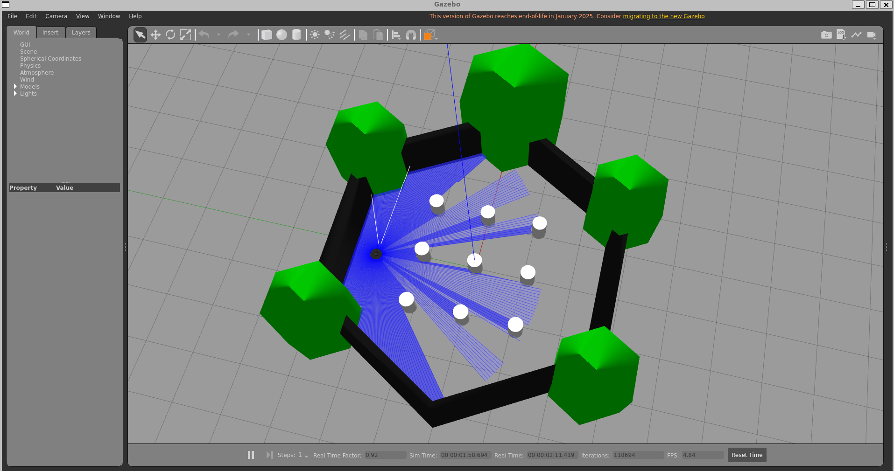
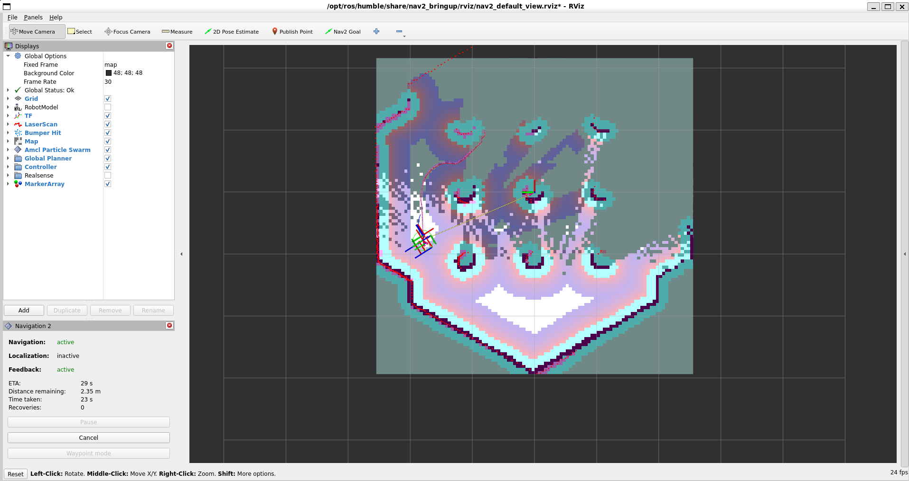
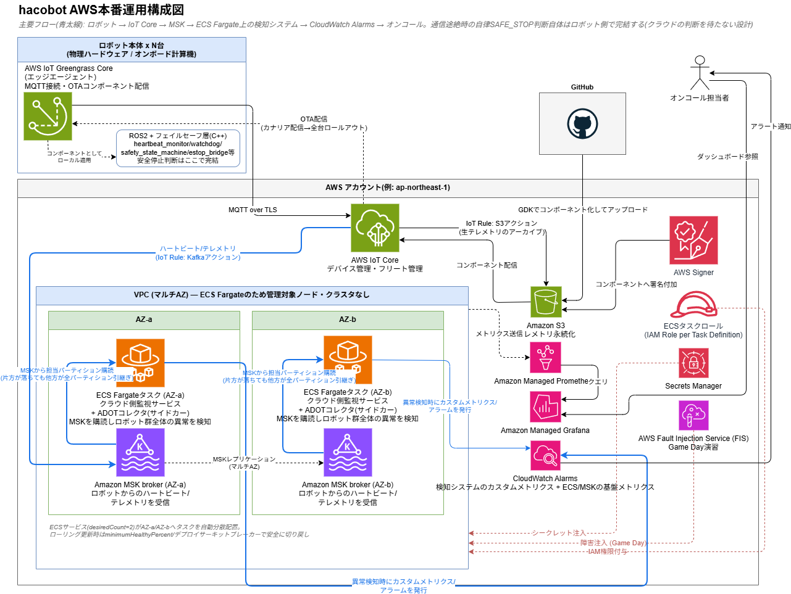
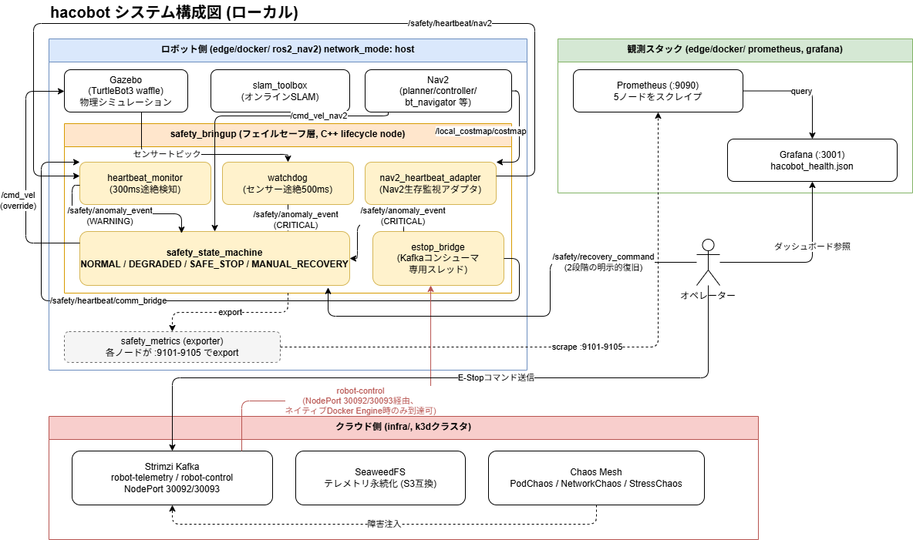

# hacobot

自動運転・配送ロボットシステムの**長時間安定稼働・フェイルセーフ・分散環境での安全な停止制御**を
検証するプロジェクトです。TurtleBot3 + Nav2による自律走行を題材に、通信途絶・センサー故障・
クラウド側障害といった異常系を実際に発生させ、ロボット側が自律的に安全停止へ倒れる仕組みを、
単体テスト・実機統合・カオスエンジニアリングの3段階で検証しています。

## シミュレーション

| Gazebo | RViz |
|---|---|
|  |  |

## 本番想定図



## アーキテクチャ図(ローカル動作時)



## 検証結果サマリー

### カオス実験: Chaos Meshによる障害注入

| 実験 | 対象 | 検証したかったこと | 結果 |
|---|---|---|---|
| `pod-chaos-kafka` | Kafka Broker Pod強制終了 | Kafkaがクラッシュしても自律SAFE_STOPへ倒れるか | ✅ Kafka Pod自体は正しくkill→自動復旧することを確認。ロボット側への波及はタイミングが合えば観測可能(下記参照) |
| `network-chaos-robot-cloud` | Kafka Pod経由で遅延250ms+ロス10%を注入 | 通信劣化時にDEGRADEDへ先行遷移するか | ✅ 実験自体は正しく適用・観測できることを確認 |
| `stress-chaos-node` | Kafka PodへCPU/メモリ負荷 | クラウド側高負荷時の挙動 | ✅ 実験自体は正しく適用できることを確認 |

**ロボット側への波及について**: k3dにKafkaのNodePortリスナーを追加
(`infra/k8s/kafka/kafka-cluster.yaml`)することで、`ros2_nav2_container`から実際に
Kafkaへ到達できるようになり、本物のKafkaメッセージで`estop_bridge`経由のE-Stopが
`/safety/state`を`SAFE_STOP`にすることをエンドツーエンドで確認済み
(`demos/07_real_kafka_estop.sh`)。ただしPodChaos実行中の接続断検知はKafkaの復旧速度
(20〜50秒程度)と接続チェック間隔(2秒)のタイミング次第で毎回検知できるとは限らない。
(実行環境による制約は「既知の制約」を参照)

### 実際にロボット側で確認できた壊し方(実機統合テスト)

上記のネットワーク制約が無い部分(ロボット自身のプロセス・センサー)は、実際に壊して
正しく安全停止することを確認済み。

| 壊し方 | 検知経路 | 実際の挙動 |
|---|---|---|
| Nav2プロセスをkill | `nav2_heartbeat_adapter` → `heartbeat_monitor`(WARNING) | NORMAL → DEGRADED(速度制限) → SAFE_STOP(完全停止)と段階的に遷移 |
| カメラ/LiDARトピックの停止 | `watchdog`(CRITICAL) | DEGRADEDを経由せず即座にSAFE_STOP |
| `recovery_command`を根本原因が直っていない状態で送信 | `heartbeat_monitor`/`watchdog`のis_stale_リセット | 偽の`NORMAL`に固定されず、再検知してSAFE_STOPへ戻ることを確認(過去に発見・修正したバグの回帰テストとしても実施) |
| Kafkaの`robot-control`トピックへ本物の`"ESTOP"`メッセージを送信 | `estop_bridge`(Kafkaコンシューマ専用スレッド) | `E-Stop command received` → `CRITICAL anomaly` → 即座にSAFE_STOP(ネイティブDocker Engineでのみ検証可能。`demos/07_real_kafka_estop.sh`) |

### 耐久試験: Soak Test

| 項目 | 状態 |
|---|---|
| `testing/soak_test/run_soak_test.py`の動作確認(60秒ドライラン) | ✅ メモリ計測・再起動検知・安全状態履歴・Nav2応答時間の記録、JSON出力まで一通り完走することを確認 |
| 24時間/72時間の本番耐久試験(メモリ増加率・予期しない再起動回数等の合格基準を設定済み) | 未実施(スクリプトは対応済み。`--duration 24h`/`--duration 72h`で今後実行可能) |

24h/72hの実行には長時間ホストを占有するため、機能検証のみ実施した。

## 技術スタック

| レイヤー | 技術 |
|---|---|
| シミュレーション | Gazebo Classic, TurtleBot3 |
| ナビゲーション | Nav2, slam_toolbox (ROS2 Humble) |
| フェイルセーフ層 | C++ (rclcpp_lifecycle), 独自メッセージ(`safety_msgs`) |
| メッセージング | Kafka (Strimzi Operator) |
| ストレージ | SeaweedFS (S3互換)※ |
| インフラ | k3d, Helm / Helmfile |
| カオスエンジニアリング | Chaos Mesh |
| 可観測性 | Prometheus, Grafana |
| 耐久試験・検証スクリプト | Python (psutil, rclpy, nav2_simple_commander) |

※ SeaweedFSと、Kafkaの`robot-telemetry`トピック(位置情報・画像等のテレメトリ用)は
将来のデータ基盤としてインフラのみ構築済みで、実際にデータを書き込むコードはまだ無い。
安全系(フェイルセーフ層)は`robot-control`(E-Stop)等の別トピックのみを使い、これらには
一切依存しない。

## ローカルセットアップ手順

ビルドからカオス実験・耐久試験・本物のKafka E-Stopまで、手順ごとに「何が見えれば成功か」
込みでまとめたものは `docs/verification_guide.md` を参照。各手順に対応する自動判定付き
bashスクリプトは `demos/`配下にある(`demos/README.md`参照、`bash demos/run_all.sh`で
まとめて実行可能)。

## 開発環境セットアップ

VSCode + Dev Containers前提(C++補完・ビルド・テスト・ブレークポイントデバッグまで
コンテナ内で完結)。

### 1. 前提

- リポジトリはWSL2ネイティブパス(`/home/<user>/...`)にクローンしていること(Windows側マウントは低速)
- VSCode拡張「Dev Containers」(`ms-vscode-remote.remote-containers`)導入済み

### 2. 起動手順

```bash
make up   # edge/docker/docker-compose.yml の ros2-nav2/prometheus/grafana を起動(停止はmake down)
```

その後VSCodeでリポジトリを開き、コマンドパレット → `Dev Containers: Reopen in Container`。
コンテナは`make up`で既に起動済みのため、VSCodeはそのままアタッチするだけになる。

続いて(初回のみ):

```bash
make infra-deploy   # k3dクラスタ + SeaweedFS/Kafka/Chaos Mesh
```

補完(clangd)は`colcon build`が生成する`compile_commands.json`を自動検出するため
追加設定不要。

### 3. ビルド・テスト(VSCode タスク)

コマンドパレット → `Tasks: Run Task`(`edge/ros2_ws/.vscode/tasks.json`):

| タスク名 | 内容 |
|---|---|
| `ROS2: colcon build (Debug)` | デフォルトビルド(Ctrl+Shift+B)。`make build`相当 |
| `ROS2: Clean and Build` | `build/install/log`を消してクリーンビルド |
| `ROS2: Run Coverage` | 全体を`--coverage`ビルド+`colcon test`+lcov集計 |
| `ROS2: Build Current Test Package (Coverage)` / `Generate Coverage Report` | 下記デバッグ実行(C)の内部タスク |

### 4. launch.jsonからのノード起動

実行とデバッグパネルから選択(`edge/ros2_ws/.vscode/launch.json`):

- `ROS2: Launch Gazebo Sim (nav2_bringup_custom)`: Gazebo+TurtleBot3起動
- `ROS2: Launch Nav2 Bringup (nav2_bringup_custom)`: Nav2フルスタック+`safety_bringup`5ノード起動

どちらも`node-terminal`型(シェルで実行するだけでデバッガは付かない)。`ros2 launch`は
複数プロセスを生成するため直接ブレークポイントは効かない。デバッグしたい場合は次項を使う。

### 5. ブレークポイントでのデバッグ

前提: `cap_add: [SYS_PTRACE]`を`docker-compose.yml`に付与済み(Dockerデフォルトでは
`ptrace(2)`禁止のためgdbアタッチが失敗する)。

| 方法 | 用途 |
|---|---|
| `ROS2: Attach to Running Node` | 上記4で既に起動中のノードにアタッチ。パッケージ名・実行ファイル名を入力後、`${command:pickProcess}`でPID選択(下記参照) |
| `ROS2: C++ Node Debug` | `ros2 launch`を介さずノード単体をgdb起動から実行。コンストラクタ等の起動直後もブレークポイント可。remap/パラメータは適用されないためノード単体の切り分け用 |
| `ROS2: Debug Current Test File` | デバッグしたいgtestの`.cpp`をアクティブにして実行。該当パッケージのみcoverageビルド→gdb実行→終了後`edge/ros2_ws/coverage/`にlcovレポート自動生成(Coverage Gutters拡張で表示) |

**`ROS2: Attach to Running Node`で何を選べばいいか**: `${command:pickProcess}`はVSCode C/C++拡張の
標準機能で、名前を指定して自動選択する仕組みは存在しない(cppdbgの`processId`はpickProcessによる
手動選択が唯一の方法)。一覧にはコンテナ内の全プロセスが並ぶが、**候補が出た状態でパッケージ名や
実行ファイル名の一部を入力すると絞り込める**ので、以下の実行ファイル名を入力してから選ぶとよい:

| パッケージ名 | 実行ファイル名(入力するのはこちら) |
|---|---|
| `heartbeat_monitor` | `heartbeat_monitor_node` |
| `safety_state_machine` | `safety_state_machine_node` |
| `watchdog` | `watchdog_node` |
| `nav2_heartbeat_adapter` | `nav2_heartbeat_adapter_node` |
| `estop_bridge` | `estop_bridge_node` |

一覧では`.../install/<パッケージ名>/lib/<パッケージ名>/<実行ファイル名>`というフルパスが
コマンドラインとして表示されるので、上記の実行ファイル名で検索すれば1件に絞り込める。

## ドキュメント

- `docs/verification_guide.md`: 動作確認の手順(ステップごとの成功の目安付き)
- `docs/architecture-diagram.drawio`: ローカル検証環境の全体構成図
- `docs/aws-production-architecture.drawio`: マルチAZ EKSを想定したAWS本番運用構成図

## 既知の制約

- このリポジトリはWSL2上のdev/検証環境を前提としている。コンテナ実行基盤がDocker Desktopか
  ネイティブDocker Engine(`docker-ce`)かで、Kafka連携の一部(リモートE-Stopの実際の到達、
  カオス実験のロボット側への波及)が検証できるかどうかが変わる(Docker Desktopはコンテナを
  別ネットワーク名前空間のVMで動かすため、k3dクラスタ内のKafkaへ到達できない)。
  **注意**: `safety_bringup.launch.py`は`estop_bridge`を`assume_healthy: false`
  (実際にTCP疎通チェックを行う設定)で起動する。Docker Desktop環境ではこの疎通チェックが
  常に失敗し、`comm_bridge`のハートビートが一度も送られないため、起動から数秒で
  `heartbeat_monitor`がハートビート途絶を検知してSAFE_STOPへ遷移する
  (これはフェイルセーフとして正しい挙動だが、Docker Desktopで単に動作確認したいだけの場合は
  想定外の停止に見える)。回避するには`estop_bridge`の`assume_healthy`パラメータを
  `true`で上書きして起動すること
- k3dはシングルノード構成であり、クラスタ自体の高可用性は範囲外。マルチAZ構成のAWS本番設計は
  `docs/aws-production-architecture.drawio`を参照
- カオス実験実行中のロボット側の反応検知(`demos/05_chaos_experiment.sh`)は、Kafka Podの
  復旧速度(20〜50秒程度)と`estop_bridge`の接続チェック間隔(2秒)のタイミング次第で
  毎回検知できるとは限らない。フェイルセーフの実効性そのものは`demos/03`/`demos/07`で
  安定して確認できる
- Gazebo(`gzserver`)はデフォルトではWSL2上でGPUパススルーが有効にならず、ソフトウェア
  レンダリング(Mesa `swrast`)にフォールバックしてCPU使用率が跳ね上がる(実測700〜800%)。
  `edge/docker/docker-compose.yml`で`/dev/dxg`・`/usr/lib/wsl`をコンテナへ渡すことで解消
  (8〜10倍のCPU削減を確認)。あわせてLiDARセンサーも`type="ray"`(CPUレイキャスト)から
  `type="gpu_ray"`へパッチ済み(`Dockerfile`参照)。それでもなお`/scan`が数十秒に一度、
  1〜2秒程度途絶しSAFE_STOPを誘発することがある。gzserver自体の内部ブロッキングは
  strace調査で否定済みで、DDS通信層かサブスクライバ側(`watchdog`)に原因がある可能性が
  高いが未特定(2026年7月時点、調査継続中)
